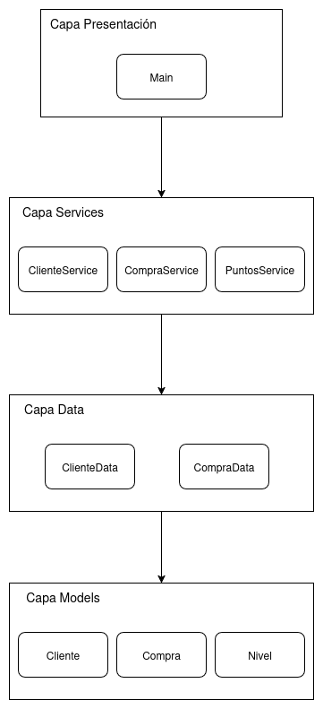
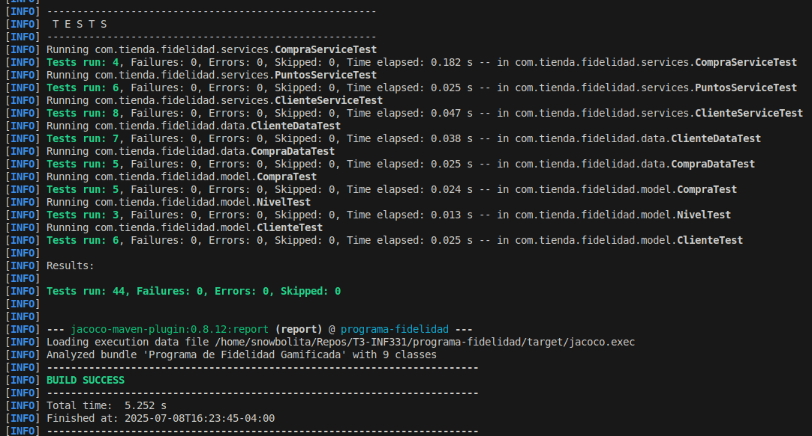
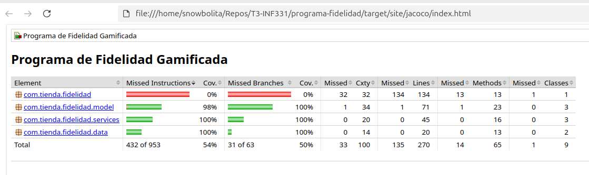

# Programa de Fidelidad de Clientes

## 1. Descripción del Proyecto

Este proyecto implementa una aplicación de consola para gestionar un programa de fidelidad de clientes. El sistema permite la administración de clientes y sus niveles de membresía, el registro de compras y la asignación de puntos de fidelidad basados en reglas de negocio predefinidas.

La arquitectura del sistema sigue un diseño orientado a objetos, separando las responsabilidades en capas claramente definidas para facilitar el mantenimiento y la escalabilidad.

## 2. Especificaciones Técnicas

| Ítem | Detalle |
|-------------------------------|----------------------------------------------------|
| **Tipo de Aplicación** | Aplicación de consola (CLI) |
| **Lenguaje de Programación** | Java 21+ |
| **Herramienta de Construcción** | Apache Maven |
| **Framework de Pruebas** | JUnit 5 |
| **Persistencia de Datos** | En memoria |
| **Paradigma de Diseño** | Orientado a Objetos (Capas de Presentación, Servicios y Datos) |
| **Metodología de Desarrollo** | Test-Driven Development (TDD) |
| **Análisis de Cobertura** | JaCoCo (integrado vía Maven) |

## 3. Diseño de la Aplicación

La arquitectura del programa está organizada en capas, como se muestra en el siguiente diagrama. Este diseño separa las responsabilidades, donde la capa de presentación interactúa con el usuario, la de servicios contiene la lógica de negocio, la de datos gestiona la persistencia en memoria y el modelo define las entidades del sistema.



## 4. Instrucciones de Uso

### Prerrequisitos
* Java Development Kit (JDK) 21 o superior.
* Apache Maven.

### Compilación
Para compilar el proyecto, navegue hasta la carpeta `programa-fidelidad` y ejecute:
```bash
mvn clean compile
```

### Ejecución
Para ejecutar la aplicación en modo interactivo desde la consola:
```bash
mvn exec:java -Dexec.mainClass="com.tienda.fidelidad.Main"
```

### Pruebas y Cobertura
Para ejecutar todas las pruebas unitarias y generar el reporte de cobertura de código con JaCoCo:
```bash
mvn clean verify
```
El reporte de cobertura estará disponible en `target/site/jacoco/index.html`, este de todas maneras se encuentra en el repositorio.

## 5. Salida de Pruebas de Ejemplo

La siguiente imagen muestra la salida en consola de una ejecución exitosa de las pruebas.



## 6. Análisis de Cobertura de Código

El reporte de JaCoCo proporciona una visión detallada de la efectividad del conjunto de pruebas. La siguiente imagen es una captura del resumen de cobertura del proyecto.



### Tipo de cobertura medida

Se han medido principalmente dos tipos de cobertura, que son los estándares utilizados por la herramienta JaCoCo:

1.  **Cobertura de Instrucciones (Instruction Coverage):** Mide el porcentaje de instrucciones de bytecode de Java que son ejecutadas por las pruebas.

2.  **Cobertura de Ramas (Branch Coverage):** Mide el porcentaje de caminos lógicos (ej. las ramas `true` y `false` de una sentencia `if`) que han sido cubiertos por las pruebas.

**La razón para medir ambas es obtener una visión fiable de la calidad de las pruebas.** Una alta cobertura de líneas puede ser engañosa; una prueba puede ejecutar una línea de código sin cubrir todas sus ramificaciones lógicas. La cobertura de ramas es fundamental para asegurar que las diferentes condiciones y lógicas del negocio han sido validadas, lo que aumenta la confianza en la robustez del software.

Como se observa en el reporte, las capas de `services` y `data` tienen una cobertura del 100%, mientras que la capa de `model` tiene un 98%, lo que indica una excelente calidad en las pruebas de la lógica de negocio. El 0% de cobertura en el paquete `com.tienda.fidelidad` es esperado, ya que contiene la clase `Main` (UI), la cual no se prueba con tests unitarios.

## 7. Licencia

Este proyecto está licenciado bajo la Licencia MIT.

```text
MIT License

Copyright (c) 2025 <Tu Nombre o el Nombre del Propietario>

Permission is hereby granted, free of charge, to any person obtaining a copy
of this software and associated documentation files (the "Software"), to deal
in the Software without restriction, including without limitation the rights
to use, copy, modify, merge, publish, distribute, sublicense, and/or sell
copies of the Software, and to permit persons to whom the Software is
furnished to do so, subject to the following conditions:

The above copyright notice and this permission notice shall be included in all
copies or substantial portions of the Software.

THE SOFTWARE IS PROVIDED "AS IS", WITHOUT WARRANTY OF ANY KIND, EXPRESS OR
IMPLIED, INCLUDING BUT NOT LIMITED TO THE WARRANTIES OF MERCHANTABILITY,
FITNESS FOR A PARTICULAR PURPOSE AND NONINFRINGEMENT. IN NO EVENT SHALL THE
AUTHORS OR COPYRIGHT HOLDERS BE LIABLE FOR ANY CLAIM, DAMAGES OR OTHER
LIABILITY, WHETHER IN AN ACTION OF CONTRACT, TORT OR OTHERWISE, ARISING FROM,
OUT OF OR IN CONNECTION WITH THE SOFTWARE OR THE USE OR OTHER DEALINGS IN THE
SOFTWARE.
```